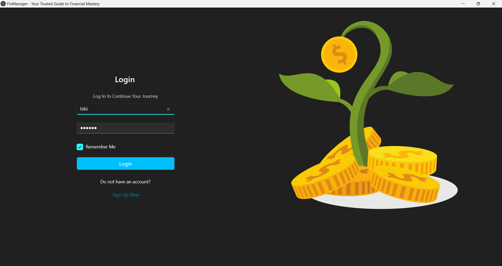
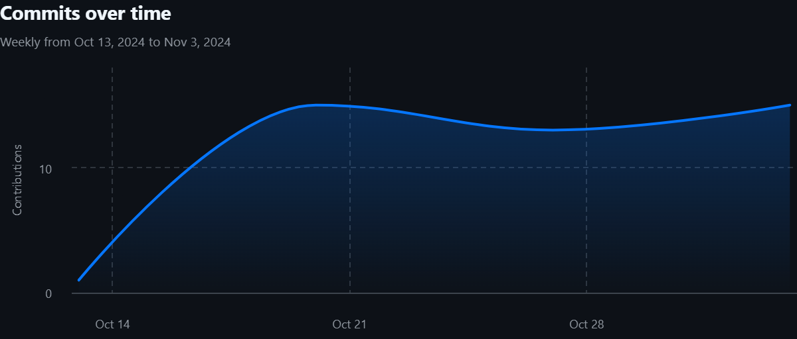

# MILESTONE 01

### CSC 13001 - Lập trình ứng dụng Windows

# Báo cáo đồ án môn học

### Thành viên nhóm

| STT | MSSV | Họ tên |
| --- | --- | --- |
| 1 | 22120334 | Nguyễn Quang Thắng |
| 2 | 22120335 | Trương Tâm Thành |
| 3 | 22120336 | Võ Tuấn Thành |

### Mô tả chung về ứng dụng

**FinManager** là ứng dụng Windows hỗ trợ quản lý tài chính cá nhân. Ứng dụng cho phép người dùng ghi chép thu chi, đặt mục tiêu tài chính, tạo báo cáo tài chính và nhiều tính năng khác kèm theo.

## 1. Công nghệ sử dụng

### Frontend

- WinUI 3 (Windows App SDK)
- C# (.NET 7)
- MVVM Pattern
- Template Studio

### Backend

- NestJS (TypeScript)
- PostgreSQL + TypeORM
- RESTful API

### Development Tools

- Docker
- Git
- Visual Studio 2022 / VS Code

## 2. Các tính năng đã phát triển

**Các tính năng lựa chọn trong Milestone 1**

- Đăng nhập/ Đăng ký
- Quản lý tài khoản
- Ghi chép và thống kê giao dịch
- Quy đổi tiền tệ real-time

## 3. UX / UI

### Giao diện

- Giao diện được thiết kế sử dụng Template Studio với Navigation Bar, tối giản theo Windows 11 Design Principles.
- Responsive theo các kích thước màn hình
- Hỗ trợ dark/ light mode theo system.
- **Một số hình ảnh UI của ứng dụng**
    
    
    
    
    
    
    
    
    
    
    
    
    
    
    
    
    

### Trải nghiệm người dùng

- Xử lý các lỗi (Mất kết nối, time out, validation input,...)
- Show error dialog cho user

## 4. Kiến trúc hệ thống

### Backend

- **Module Pattern:** Tách biệt các chức năng của Backend bằng các Module (Nest JS conventional)
- **Dependencies Injection:** Sử dụng DI pattern thông qua decorators như @Injectable(), @Inject()
- **Repository Pattern:** Sử dụng TypeORM repository để tương tác với database

### Frontend

- **MVVM Pattern:** Pattern quan trọng nhất, là cấu trúc chính của dự án, tách biệt Bussiness Logic và UI
- **Dependency Injection:** Đăng ký các Service bằng *Microsoft.Extensions.DependencyInjection*

**Thông tin chi tiết về kiến trúc của dự án: [FinManager Documentation](https://azzurriii.github.io/Fin-Manager-Windows-App/)**

## 5. Các tính năng nâng cao

**Authorize với Local Storage**

- Lưu mật khẩu (Đã mã hóa) vào Local Storage
- Lưu Access Token để làm Header cho Authorize dAPI Endpoint

**Dependencies Injection**

- Sử dụng DI pattern trong cả frontend và backend
- **Frontend (WinUI):**
    
    ```
        public CurrencyViewModel(ICurrencyService currencyService, IDialogService dialogService)
        {
            _currencyService = currencyService ?? throw new ArgumentNullException(nameof(currencyService));
            _dialogService = dialogService ?? throw new ArgumentNullException(nameof(dialogService));
    
            SelectedFromCurrency = CurrencyList.FirstOrDefault() ?? "VND";
            SelectedToCurrency = CurrencyList.Skip(1).FirstOrDefault() ?? "USD";
            Amount = 0;
        }
    ```
    
- **Backend (NestJS):**
    
    ```
    @Injectable()
    export class AdminInitializerService implements OnModuleInit {
    ```
    

**Attribute-based Programming**

- Sử dụng các attribute để định nghĩa metadata:
    - `[ObservableProperty]` cho data binding
    - `[RelayCommand]` cho commands
    - `[JsonPropertyName]` cho serialization

**Asynchronous Programming**

- Sử dụng async/await pattern
- Task-based Asynchronous Pattern (TAP)
- Exception handling trong async methods

**Docker**

- Tạo Database trên [Localhost](http://Localhost) bằng Docker
- Data Migration và Seeding

**Resource Management**

- Localization support với `Resources.resw`
- Theme management
- Dynamic resource loading

**Sử dụng Http Client cho kết nối REST API**

- Lớp `IApiConfiguration` dùng để config API Endpoint, đảm bảo tính thống nhất, dễ bảo trì trong quá trình tích hợp.
    
    ```csharp
    public class ApiConfiguration : IApiConfiguration
    {
        public string BaseUrl => "http://localhost:3000/";
    }
    ```
    
    ```csharp
    services.AddHttpClient<ITransactionService, TransactionService>((provider, client) =>
            {
                var config = provider.GetRequiredService<IApiConfiguration>();
                client.BaseAddress = new Uri(config.BaseUrl);
            });
    ```
    

**Two-way binding**

- Được triển khai thông qua MVVM pattern với CommunityToolkit.Mvvm:

**Data converters**

- Chuyển đổi dữ liệu giữa `Model` và `View`
- Các Converter đã Implement:
    - `TransactionTypeToColorConverter` Chỉnh sửa màu của giao dịch dựa trên `TransactionType`
    - `StringToVisibilityConverter` chuyển đổi một chuỗi thành một giá trị `Visibility`
    - `NullToVisibilityConverter` Điều khiển sự hiển thị của các UI elements dựa trên việc một giá trị có tồn tại hay không.

**Dispatcher Queue**

- Xử lý UI updates an toàn trên main thread:
    
    ```csharp
        private Microsoft.UI.Dispatching.DispatcherQueue dispatcherQueue;
    
        private UISettings settings;
    
        public MainWindow()
        {
            InitializeComponent();
    
            AppWindow.SetIcon(Path.Combine(AppContext.BaseDirectory, "Assets/WindowIcon.ico"));
            Content = null;
            Title = "AppDisplayName".GetLocalized();
    
            // Theme change code picked from https://github.com/microsoft/WinUI-Gallery/pull/1239
            dispatcherQueue = Microsoft.UI.Dispatching.DispatcherQueue.GetForCurrentThread();
            settings = new UISettings();
            settings.ColorValuesChanged += Settings_ColorValuesChanged; // cannot use FrameworkElement.ActualThemeChanged event
        }
    
        // this handles updating the caption button colors correctly when indows system theme is changed
        // while the app is open
        private void Settings_ColorValuesChanged(UISettings sender, object args)
        {
            // This calls comes off-thread, hence we will need to dispatch it to current app's thread
            dispatcherQueue.TryEnqueue(() =>
            {
                TitleBarHelper.ApplySystemThemeToCaptionButtons();
            });
        }
    
    ```
    

**Testing Infrastructure**

Test Lifecycle Hooks:

- Test Lifecycle Hooks:
- ClassInitialize/Cleanup
- TestInitialize/Cleanup
- Debug logging

UI Testing:

- UITestMethod attribute cho UI tests
- Dispatcher integration
- UI element testing

Test Coverage:

- Coverlet collector integration
- Code coverage reporting
- Test result analysis

## 6. Quá trình làm việc nhóm

### Task management

- Thời gian quy định tối thiểu là 10h cho 3 thành viên

**Bảng đánh giá mức độ hoàn thành công việc**

| STT | Task | Người thực hiện | Đánh giá |
| --- | --- | --- | --- |
| 1 | Login/ Signup | Nguyễn Quang Thắng | 100% |
| 2 | Account Management | Trương Tâm Thành | 100% |
| 3 | Transaction Management | Võ Tuấn Thành | 100% |
| 4 | Documentation | Võ Tuấn Thành | 100% |
| 5 | Currency Exchange | Nguyễn Quang Thắng | 100% |
| 6 | Unit testing | Nguyễn Quang Thắng | 100% |
| 7 | Reporting | Trương Tâm Thành | 100% |
| 8 | UI Design | Võ Tuấn Thành | 100% |

**Task management: [Trello Link](https://trello.com/b/Grs9j7G3)**

### Quy trình

**Quy trình làm việc:**

- Quản lý công việc: Agile Scrum .
- Weekly Meeting (22h tối thứ 7 hàng tuần).

**Biên bản họp nhóm: [Google Docs link](https://docs.google.com/document/d/1c4RKeFFXiVMsx33t-6TKHI2u_UlT5-Me5uAFccaixzc/edit?usp=sharing)**

### Quá trình làm việc trên GIT

**Project's Repository link: [GitHub link](https://www.notion.so/vtthanh/%5B%3Chttps://github.com/Azzurriii/Fin-Manager-Windows-App%3E%5D(%3Chttps://github.com/Azzurriii/Fin-Manager-Windows-App%3E))**

**Git flow**

- Git flow của dự án
    
    
    
    
    
    
    
    
    
    
    
    
    
    
    

## 7. Quá trình đảm bảo chất lượng

### Quá trình mã nguồn được duyệt và cho vào mã nguồn chính

**Quy định với GitHub**

- Mỗi lần tạo mỗi tính năng hay sửa đổi bất kì chi tiết gì đều phải commit trên một nhánh khác, sau đó tạo pull request để thành viên khác review
- Mỗi pull request phải được 2 thành viên còn lại review kĩ trước khi merge vào nhánh `main`
- Các conflicts cần phải trao đổi giữa người commit và leader để giải quyết.
- Mỗi nhánh hoặc commit message phải có tag để phân loại thay đổi.
- Quy định về commit conventional được tham khảo ở [Convetional Commit](https://www.conventionalcommits.org/en/v1.0.0/)
- Leader là người init project theo Template MVVM, và các thành viên phải tuân theo mô hình này trong suốt dự án.

### Quá trình Test

Unit Test và UI Test được thực hiện bằng Template MSTest

- TransactionModelTest

**File**: `Test/Models/TransactionModelTest.cs`

| Test Method | Description | Expected Result |
| --- | --- | --- |
| FormattedAmount_Income_ShowsPlusSign | Kiểm tra format số tiền thu | "+1,000 đ" |
| FormattedAmount_Expense_ShowsMinusSign | Kiểm tra format số tiền chi | "-1,000" |
| FormattedDate_ReturnsCorrectFormat | Kiểm tra format ngày tháng | "15/03/2024" |

**Service Tests**

- CurrencyServiceTest

**File**: `Test/Services/CurrencyServiceTest.cs`

| Test Method | Description | Expected Result |
| --- | --- | --- |
| ConvertCurrency_ValidConversion_ShouldSucceed | Kiểm tra chuyển đổi tiền tệ hợp lệ | Trả về kết quả chuyển đổi chính xác |
| ConvertCurrency_InvalidCurrency_ShouldThrowException | Kiểm tra mã tiền tệ không hợp lệ | Throw HttpRequestException |
| ConvertCurrency_ZeroAmount_ShouldSucceed | Kiểm tra chuyển đổi số tiền 0 | Trả về kết quả 0 |
| ConvertCurrency_ServerError_ShouldThrowException | Kiểm tra lỗi server | Throw HttpRequestException |
| ConvertCurrency_NetworkError_ShouldThrowException | Kiểm tra lỗi mạng | Throw HttpRequestException |
- TransactionServiceTest

**File**: `Test/Services/TransactionServiceTest.cs`

| Test Method | Description | Expected Result |
| --- | --- | --- |
| CreateTransactionAsync_ValidTransaction_ShouldSucceed | Tạo giao dịch hợp lệ | Return true |
| CreateTransactionAsync_FailedTransaction_ShouldReturnFalse | Tạo giao dịch thất bại | Return false |
| GetTotalAmountAsync_ValidRequest_ShouldReturnAmount | Lấy tổng số tiền | Trả về số tiền chính xác |
| GetTotalAmountAsync_ServerError_ShouldReturnZero | Xử lý lỗi server khi tính tổng | Return 0 |
| GetUserTransactionsAsync_ValidUserId_ShouldReturnTransactions | Lấy danh sách giao dịch của user | Trả về list giao dịch |
| GetUserTransactionsAsync_InvalidUserId_ShouldReturnEmptyList | Lấy giao dịch với user không tồn tại | Return empty list |
| GetUserTransactionsAsync_ServerError_ShouldReturnEmptyList | Xử lý lỗi server | Return empty list |
- TagServiceTest

**File**: `Test/Services/TagServiceTest.cs`

| Test Method | Description | Expected Result |
| --- | --- | --- |
| GetTagsAsync_ValidRequest_ShouldReturnTags | Lấy danh sách tags | Trả về list tags |
| GetTagsAsync_ApiError_ShouldReturnEmptyList | Xử lý lỗi API | Return empty list |
| GetTagAsync_ValidId_ShouldReturnTag | Lấy tag theo ID | Trả về tag object |
| GetTagAsync_InvalidId_ShouldReturnNull | Lấy tag không tồn tại | Return null |
| CreateTagAsync_ValidRequest_ShouldReturnCreatedTag | Tạo tag mới | Trả về tag đã tạo |
| CreateTagAsync_ApiError_ShouldThrowException | Xử lý lỗi khi tạo tag | Throw Exception |
| DeleteTagAsync_ValidId_ShouldSucceed | Xóa tag | Không có exception |
| DeleteTagAsync_ApiError_ShouldThrowException | Xử lý lỗi khi xóa tag | Throw HttpRequestException |
- PageServiceTest

**File**: `Test/Services/PageServiceTest.cs`

| Test Method | Description | Expected Result |
| --- | --- | --- |
| Configure_AddsPageMappingSuccessfully | Kiểm tra thêm page mapping | Mapping được thêm thành công |
| GetPageType_ValidKey_ReturnsCorrectPageType | Lấy page type hợp lệ | Trả về đúng page type |
| GetPageType_InvalidKey_ThrowsException | Lấy page type không tồn tại | Throw ArgumentException |
- DialogServiceTest

**File**: `Test/Services/DialogServiceTest.cs`

| Test Method | Description | Expected Result |
| --- | --- | --- |
| ShowErrorAsync_ShouldInvokeShowDialog | Hiển thị dialog lỗi | Dialog được hiển thị |
| ShowWarningAsync_ShouldInvokeShowDialog | Hiển thị dialog cảnh báo | Dialog được hiển thị |
| ShowConfirmAsync_ShouldReturnTrueForPrimaryResult | Kiểm tra xác nhận dialog | Return boolean |
| ShowDialog_WithException_ShouldHandleGracefully | Xử lý exception trong dialog | Không throw exception |

**View Tests**

**TransactionPageTest**

**File**: `Test/Views/TransactionPageTest.cs`

| Test Method | Description | Expected Result |
| --- | --- | --- |
| TransactionPage_InitializesCorrectly | Kiểm tra khởi tạo page | ViewModel không null |
| AddTransactionDialog_OpensAndCloses | Kiểm tra đóng/mở dialog | Dialog state thay đổi đúng |

**Test Coverage**

| Component | Coverage | Notes |
| --- | --- | --- |
| Models | 70% | Chưa test hết các Model |
| Services | 100% | Đã test các scenarios chính |
| Views | 80% | Cần thêm test cho các views khác |
| ViewModels | 70% | Đang phát triển thêm |

## 8. Hướng dẫn khởi chạy mã nguồn

### Yêu cầu

- Docker Engine
- Node.js và npm
- Visual Studio 2022
- PostgreSQL

### Mã nguồn

- Mã nguồn được cung cấp trong thư mục `Source`
- Bạn cũng có thể clone mã nguồn thông qua lệnh:

```bash
git clone https://github.com/Azzurriii/Fin-Manager-Windows-App.git
```

### Khởi chạy Server Backend

> Vì đây chưa phải phiên bản hoàn thiện, nên Server chưa được Deploy, mà thay đó sẽ chạy bằng Local host.
> 
1. Tạo Database Postgres
    - Start Docker Engine
    - Tạo Postgres bằng Docker Pull
    
    ```bash
    docker run --name my_postgres -e POSTGRES_USER=myuser -e POSTGRES_PASSWORD=mypassword -e POSTGRES_DB=mydatabase -p 5433:5432 -d postgres
    ```
    
2. Khởi chạy Backend NestJS
    
    Change Directory đến `sources/nest-backend`
    
    ```bash
    npm install
    ```
    
    ```bash
    npm run start:dev
    ```
    
    Sau khi nhìn thấy log `LOG [NestApplication] Nest application successfully started` thì có nghĩa là Server đã khởi chạy thành công ở địa chỉ **`http://localhost:3000/`**
    
    - Có thể truy cập: 
    **`http://localhost:3000/docs`  để xem API Description (Swagger UI)**
3. Migration Data
    
    Để Migration Data, mở terminal khác, chạy:
    
    ```bash
    npm run migration:run
    ```
    
    Terminal sẽ hiển thị thông báo Data đã được Migration thành công
    

Đang chờ @Nguyen Quang Thang Compose

### Khởi chạy WinUI Frontend

- Với UI, mở thư mục `sources\win-ui-frontend\Fin-Manager-v2` , sau đó chọn mở file `Fin-Manager-v2.sln`  bằng Visual Studio, rồi nhấn `Ctrl + F5` để chạy App
- Màn hình Login được hiển thị cho thấy ta đã khởi chạy App thành công