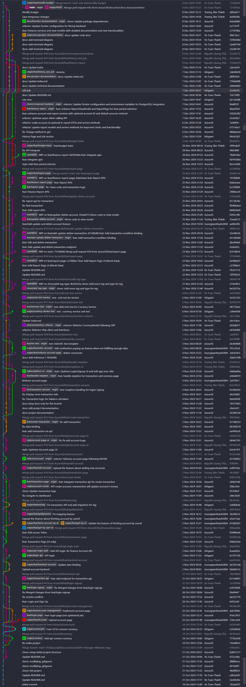
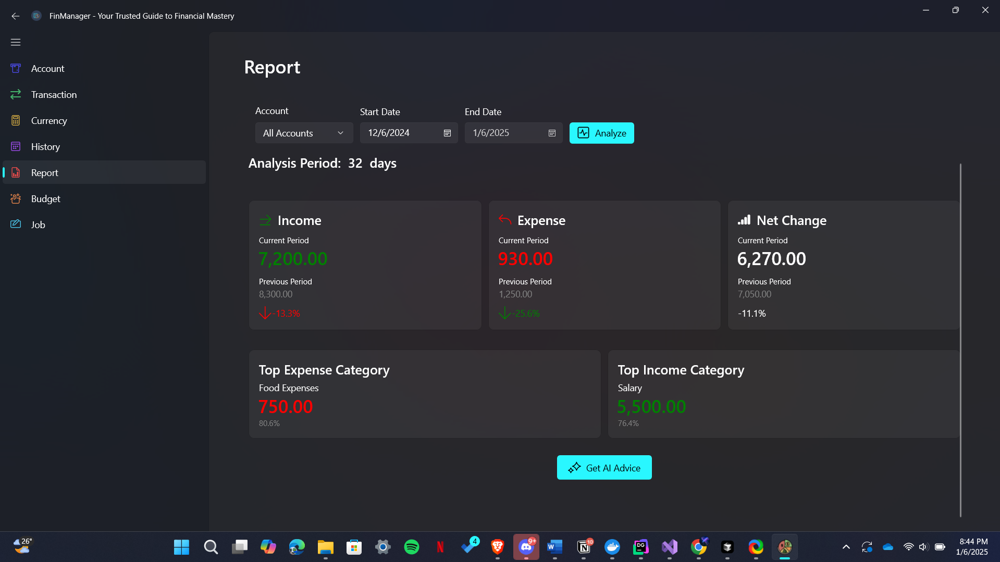

# MILESTONE 03

### CSC13001 - Lập trình ứng dụng Windows

# Milestone 3

### Video Demo

### Thành viên nhóm

| STT | MSSV | Họ tên |
| --- | --- | --- |
| 1 | 22120334 | Nguyễn Quang Thắng |
| 2 | 22120335 | Trương Tâm Thành |
| 3 | 22120336 | Võ Tuấn Thành |

### Mô tả chung về ứng dụng

**FinManager** là ứng dụng Windows hỗ trợ quản lý tài chính cá nhân. Ứng dụng cho phép người dùng ghi chép thu chi, đặt mục tiêu tài chính, tạo báo cáo tài chính và nhiều tính năng khác kèm theo.

## 1. Công nghệ sử dụng

### Frontend

- WinUI 3 (Windows App SDK)
- C# (.NET 7)
- MVVM Pattern
- Template Studio

### Backend

- NestJS (TypeScript)
- PostgreSQL + TypeORM
- REST API

### Development Tools

- Docker
- Git
- Visual Studio 2022 / VS Code

## 2. Các tính năng đã phát triển

**MILESTONE 1:**

| STT | Tên tính năng | Tình trạng | Số giờ làm việc |
| --- | --- | --- | --- |
| 1 | Đăng nhập/ Đăng ký | Hoàn thành | 2 |
| 2 | Quản lý tài khoản | Hoàn thành | 3 |
| 3 | Ghi chép và thống kê giao dịch | Hoàn thành | 2 |
| 4 | Quy đổi tiền tệ real-time | Hoàn thành | 4 |

**MILESTONE 2**

| STT | Tên tính năng | Tình trạng | Số giờ làm việc |
| --- | --- | --- | --- |
| 5 | Đặt lịch cho các khoản thu chi cố định | Hoàn thành | 3 |
| 6 | Quản lý ngân sách | Hoàn thành | 3 |
| 7 | Thống kê thu chi và báo cáo | Hoàn thành | 3 |
| 8 | Phân loại và lọc chi tiêu | Hoàn thành | 3 |

**MILESTONE 3**

| STT | Tên tính năng | Tình trạng | Số giờ làm việc |
| --- | --- | --- | --- |
| 5 | Xuất file data chi tiêu dưới dạng CSV | Hoàn thành | 3 |
| 6 | Phân tích chi tiêu | Hoàn thành | 3 |
| 7 | Đặt lời nhắc thông minh qua email | Hoàn thành | 3 |
| 8 | Nhận lời khuyên từ AI | Hoàn thành | 3 |

## 3. UX / UI

### Giao diện

- Giao diện được thiết kế sử dụng Template Studio với Navigation Bar, tối giản theo Windows 11 Design Principles.
- Responsive theo các kích thước màn hình
- Hỗ trợ dark/ light mode theo system.

### Trải nghiệm người dùng

- Xử lý các lỗi (Mất kết nối, time out, validation input,...)
- Show error dialog cho user

## 4. Kiến trúc hệ thống

Kiến trúc hệ thống vẫn tuân thủ nghiêm ngặt kiến trúc đã đặt ra từ đầu:

### Backend

- **Module Pattern:** Tách biệt các chức năng của Backend bằng các Module (Nest JS conventional)
- **Dependencies Injection:** Sử dụng DI pattern thông qua decorators như @Injectable(), @Inject()
- **Repository Pattern:** Sử dụng TypeORM repository để tương tác với database

### Frontend

- **MVVM Pattern:** Pattern quan trọng nhất, là cấu trúc chính của dự án, tách biệt Bussiness Logic và UI
- **Dependency Injection:** Đăng ký các Service bằng *Microsoft.Extensions.DependencyInjection*

**Thông tin chi tiết về kiến trúc của dự án: [FinManager Documentation](https://azzurriii.github.io/Fin-Manager-Windows-App/)**

**Docstring của các hàm đã được diễn giải chi tiết ở trong source code**

## 5. Các tính năng nâng cao

**Ngoài các tính năng nâng cao đã giới thiệu ở MILESTONE 1 như:**

- Authorize với Local Storage
- Dependencies Injection
- Asynchronous Programming
- Resource Management
- Dispatcher Queue
- Testing Infrastructure

**Ở MILESTONE 3, các tính năng nâng cao đã được áp dụng thêm là:**

- **OpenAI:** Sử dụng AI model từ API của OpenAI với tuning prompt để đạt hiệu quả phân tích tài chính
- **Maintainability Features**
    - Áp dụng các convention về clean code, structure, design pattern đã đặt ra từ đầu và đã phát triển được từ Milestone 1
- **Data converters**
    - Sử dụng các phương thức trong `/Converters` để covert các giá trị, kiểu sang thành các dạng hiển thị khác nhau.
    - Ví dụ: `TypeToIcon`, `DateFormater`, `DateToString`,…
- **Xử lý vấn đề Bất đồng bộ (Asynchronous)**
    1. **Parallel API Calls**
        
        ```csharp
        // Gọi API đồng thời, không chờ đợi lẫn nhau
        var summaryTask = FetchSummaryAsync(startDate, endDate);
        var overviewTask = FetchOverviewAsync(startDate, endDate);
        var incomeTask = FetchCategoryReportAsync("INCOME", startDate, endDate);
        var expenseTask = FetchCategoryReportAsync("EXPENSE", startDate, endDate);
        
        ```
        
        - Các API calls được thực hiện song song
        - Không block main thread
        - Tối ưu thời gian thực thi
    2. **Task Coordination**
        
        ```csharp
        // Chờ tất cả tasks hoàn thành
        await Task.WhenAll(summaryTask, overviewTask, incomeTask, expenseTask);
        
        ```
        
        - Sử dụng `Task.WhenAll` để đồng bộ hóa các tasks
        - Đảm bảo tất cả data đã sẵn sàng trước khi update UI
        - Xử lý hiệu quả nhiều tasks bất đồng bộ
    3. **Efficient Task Result Usage**
        
        ```csharp
        // Lấy kết quả từ completed tasks
        TotalIncome = (await summaryTask).TotalIncome.ToString("N");
        TotalExpense = (await summaryTask).TotalExpense.ToString("N");
        Balance = (await summaryTask).Balance.ToString("N");
        
        ```
        
        - Không cần await lại vì task đã complete
        - Tối ưu performance khi xử lý kết quả
        
        ⇒ Cách xử lý này tối ưu hóa cách sử dụng async/ await pattern, và giải quyết được vấn đề [Race condition](https://dev.to/rasulhsn/deep-dive-into-race-condition-problem-in-net-3ac6) với **.NET**
        
    
    **Tạo biểu đồ với [LiveCharts2](https://livecharts.dev/)**
    
    - Sử dụng LiveCharts2, một công cụ mã nguồn mở, hỗ trợ cho WinUI3, tạo các dạng biểu đồ như Column Chart, Pie Chart, tự động update dữ liệu chart qua tùy chọn của user

## 6. Quá trình làm việc nhóm

### Task management

- Thời gian quy định tối thiểu là 10h cho 3 thành viên

**Bảng đánh giá mức độ hoàn thành công việc**

| **STT** | **Task** | **Người thực hiện** | **Đánh giá** |
| --- | --- | --- | --- |
| 1 | Financial Analysis | Võ Tuấn Thành | 100% |
| 2 | Email Reminder | Trương Tâm Thành | 100% |
| 3 | Export datafile | Nguyễn Quang Thắng | 100% |
| 4 | AI Advice | Võ Tuấn Thành | 100% |
| 5 | Documentation & Reporting | Nguyễn Quang Thắng | 100% |
| 6 | Unit testing | Trương Tâm Thành | 100% |
| 7 | Quality Assurance | Võ Tuấn Thành | 100% |

**Task management: [Trello Link](https://trello.com/b/Grs9j7G3)**

### Quy trình

**Quy trình làm việc:**

- Quản lý công việc: Agile Scrum .
- Weekly Meeting (22h tối thứ 7 hàng tuần).

**Biên bản họp nhóm: [Meeting link](https://vtthanh.notion.site/MILESTONE-3-MEETING-173feb8ca22b80f6824bfabe8d0a246f?pvs=74)

### Quá trình làm việc trên Git

**Project's Repository link: [GitHub link](https://github.com/Azzurriii/Fin-Manager-Windows-App)**

**Git flow**

- **Git flow của dự án**
    
    
    

## 7. Quá trình đảm bảo chất lượng

### Quá trình mã nguồn được duyệt và cho vào mã nguồn chính

**Quy định với GitHub**

- Mỗi lần tạo mỗi tính năng hay sửa đổi bất kì chi tiết gì đều phải commit trên một nhánh khác, sau đó tạo pull request để thành viên khác review
- Mỗi pull request phải được 2 thành viên còn lại review kĩ trước khi merge vào nhánh `main`
- Các conflicts cần phải trao đổi giữa người commit và leader để giải quyết.
- Mỗi nhánh hoặc commit message phải có tag để phân loại thay đổi.
- Quy định về commit conventional được tham khảo ở [Convetional Commit](https://www.conventionalcommits.org/en/v1.0.0/)
- Leader là người init project theo Template MVVM, và các thành viên phải tuân theo mô hình này trong suốt dự án.

### Quá trình Test

Unit Test và UI Test được thực hiện bằng Template MSTest, ngoài các test đã trình bày ở MILESTONE 1, đây là các test đã thực hiện:

**Service Test**

JobServiceTest

`GetJobs_ShouldReturnAllJobs`: Kiểm tra lấy tất cả jobs từ database

`AddJob_ShouldAddNewJobToDatabase`: Kiểm tra thêm mới job vào database

`UpdateJob_ShouldUpdateExistingJob`: Kiểm tra cập nhật thông tin job

`DeleteJob_ShouldRemoveJobFromDatabase`: Kiểm tra xóa job khỏi database

BudgetServiceTest

`GetBudgets_ShouldReturnAllBudgets`: Kiểm tra lấy tất cả budgets từ database

`AddBudget_ShouldAddNewBudgetToDatabase`: Kiểm tra thêm mới budget vào database

`UpdateBudget_ShouldUpdateExistingBudget`: Kiểm tra cập nhật thông tin budget

`DeleteBudget_ShouldRemoveBudgetFromDatabase`: Kiểm tra xóa budget khỏi database

ReportServiceTest

`GetReports_ShouldReturnAllReports`: Kiểm tra lấy tất cả reports từ database

`GenerateReport_ShouldCreateNewReport`: Kiểm tra tạo mới report

`UpdateReport_ShouldUpdateExistingReport`: Kiểm tra cập nhật thông tin report

`DeleteReport_ShouldRemoveReportFromDatabase`: Kiểm tra xóa report khỏi database

**View Model Tests**

JobViewModelTest

`LoadJobs_ShouldPopulateJobsList`: Kiểm tra load danh sách jobs vào view model

`AddJob_ShouldAddToJobsList`: Kiểm tra thêm job mới vào list

`UpdateJob_ShouldUpdateInJobsList`: Kiểm tra cập nhật job trong list

`DeleteJob_ShouldRemoveFromJobsList`: Kiểm tra xóa job khỏi list

BudgetViewModelTest

`LoadBudgets_ShouldPopulateBudgetsList`: Kiểm tra load danh sách budgets vào view model

`AddBudget_ShouldAddToBudgetsList`: Kiểm tra thêm budget mới vào list

`UpdateBudget_ShouldUpdateInBudgetsList`: Kiểm tra cập nhật budget trong list

`DeleteBudget_ShouldRemoveFromBudgetsList`: Kiểm tra xóa budget khỏi list

ReportViewModelTest

`LoadReports_ShouldPopulateReportsList`: Kiểm tra load danh sách reports vào view model

`GenerateReport_ShouldAddToReportsList`: Kiểm tra tạo report mới vào list

`UpdateReport_ShouldUpdateInReportsList`: Kiểm tra cập nhật report trong list

`DeleteReport_ShouldRemoveFromReportsList`: Kiểm tra xóa report khỏi list

**UI Tests**

JobPageTest

`AddJobButton_ShouldShowAddJobForm`: Kiểm tra hiển thị form thêm job

`SaveJob_ShouldUpdateUIAndDatabase`: Kiểm tra lưu job và cập nhật UI

`DeleteJob_ShouldRemoveFromUIAndDatabase`: Kiểm tra xóa job và cập nhật UI

BudgetPageTest

`AddBudgetButton_ShouldShowAddBudgetForm`: Kiểm tra hiển thị form thêm budget

`SaveBudget_ShouldUpdateUIAndDatabase`: Kiểm tra lưu budget và cập nhật UI

`DeleteBudget_ShouldRemoveFromUIAndDatabase`: Kiểm tra xóa budget và cập nhật UI

ReportPageTest

`GenerateReportButton_ShouldShowReportForm`: Kiểm tra hiển thị form tạo report

`SaveReport_ShouldUpdateUIAndDatabase`: Kiểm tra lưu report và cập nhật UI

`DeleteReport_ShouldRemoveFromUIAndDatabase`: Kiểm tra xóa report và cập nhật UI

## 8. Một số hình ảnh demo




## 9. Hướng dẫn khởi chạy mã nguồn

### Yêu cầu

- Docker Engine
- Node.js và npm
- Visual Studio 2022
- PostgreSQL

### Mã nguồn

- Mã nguồn được cung cấp trong thư mục `Source`
- Bạn cũng có thể clone mã nguồn thông qua lệnh:
    
    ```bash
    git clone https://github.com/Azzurriii/Fin-Manager-Windows-App.git
    ```
    

### Khởi chạy Server Backend

> Backend đã được host, vì vậy không cần thiết phải khởi chạy ở local nữa
>

Hoặc cũng có thể

1. Tạo Database Postgres
    - Start Docker Engine
    - Tạo Postgres bằng Docker run
    
    ```bash
    docker run --name my_postgres -e POSTGRES_USER=myuser -e POSTGRES_PASSWORD=mypassword -e POSTGRES_DB=mydatabase -p 5432:5432 -d postgres
    ```
    
2. Khởi chạy Backend NestJS
    
    Change Directory đến `sources/nest-backend`
    
    Tạo file `.env`
    
    ```
    DB_HOST="localhost"
    DB_PORT="5432"
    DB_USERNAME="myuser"
    DB_PASSWORD="mypassword"
    DB_NAME="mydatabase"
    PORT="3000"
    NODE_ENV="development"
    OPENAI_API_KEY="api-key"
    ```
    
    ```bash
    npm install
    ```
    
    ```bash
    npm run start:dev
    ```
    
    Sau khi nhìn thấy log `LOG [NestApplication] Nest application successfully started` thì có nghĩa là Server đã khởi chạy thành công ở địa chỉ **`http://localhost:3000/`**
    
    - Có thể truy cập: 
    **`http://localhost:3000/docs`  để xem API Description (Swagger UI)**
3. Migration Data
    
    Để Migration Data, mở terminal khác, chạy:
    
    ```bash
    npm run migration:run
    ```
    
    Terminal sẽ hiển thị thông báo Data đã được Migration thành công
    

### Khởi chạy WinUI Frontend

- Với UI, mở thư mục `sources\win-ui-frontend\Fin-Manager-v2` , sau đó chọn mở file `Fin-Manager-v2.sln`  bằng Visual Studio, rồi nhấn `Ctrl + F5` để chạy App
- Màn hình Login được hiển thị cho thấy ta đã khởi chạy App thành công